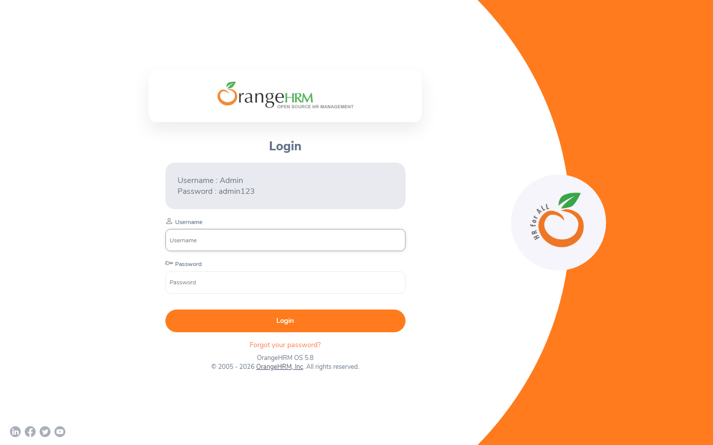
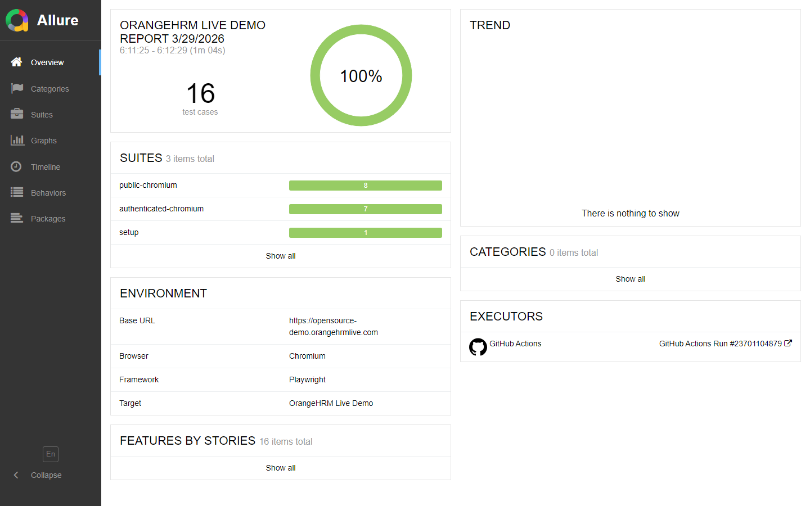

# OrangeHRM Live Demo Test Suite

[](https://github.com/melv-narrow/orange-hrm-live/actions/workflows/ci-allure.yml)
[](https://melv-narrow.github.io/orange-hrm-live/)
[](./LICENSE)

Playwright + TypeScript showcase suite for the live [OrangeHRM demo](https://opensource-demo.orangehrmlive.com/web/index.php/auth/login), built with Playwright best practices, TypeScript-first page objects, and ISTQB-minded coverage design.

The repository runs frictionless CI on every push, supports smoke or full execution from GitHub Actions, and continuously publishes a trend-enabled Allure report to GitHub Pages.

## Live artifacts

- GitHub Actions: [Workflow runs](https://github.com/melv-narrow/orange-hrm-live/actions)
- Hosted Allure report: [melv-narrow.github.io/orange-hrm-live](https://melv-narrow.github.io/orange-hrm-live/)
- Repository: [melv-narrow/orange-hrm-live](https://github.com/melv-narrow/orange-hrm-live)

## Showcase





## Coverage strategy

The suite is intentionally layered around stable, business-relevant coverage:

- `@smoke` tests for the highest-value user journeys on push.
- `@regression` tests for broader authenticated and negative-path coverage.
- Positive, negative, and access-control checks around authentication.
- Stable post-login module coverage for Dashboard, Admin, PIM, Leave, Directory, and Buzz.
- Security-oriented checks for logout protection and cleared-session redirects.
- Assertions biased toward deterministic UI behavior instead of brittle shared-demo data assumptions.

## CI/CD and reporting

The GitHub Actions workflow in `.github/workflows/ci-allure.yml` runs in three modes:

- `push`: runs the smoke suite for fast feedback.
- `workflow_dispatch`: lets you choose `smoke` or `full`.
- `schedule`: runs the full suite nightly at `00:00 UTC` (which is `02:00` in `Africa/Johannesburg`).

Allure is wired in as a first-class reporter:

- Raw results are generated on every execution.
- Historical trend data is restored from `gh-pages` before each report build.
- The rebuilt report is published back to GitHub Pages after successful full runs on `main`.
- Workflow summaries include suite mode, executed command, artifact names, and result totals.

## Local usage

```bash
npm install
npx playwright install chromium
npm test
```

Helpful commands:

```bash
npm run test:smoke
npm run test:regression
npm run test:public
npm run test:app
npm run test:headed
npm run lint
npm run format:check
npm run report
npm run allure:open
```

What happens automatically:

- `npm test` clears prior local reports before each run.
- Playwright HTML output is generated in `playwright-report/`.
- Allure raw output is generated in `allure-results/`.
- `npm run allure:generate` restores local history, builds the report, and saves updated history for the next run.

Note: local Allure HTML viewing uses the Allure CLI and requires Java. The hosted GitHub Pages report does not require any local Java setup.

## Project structure

```text
src/
  config/       runtime constants and test data
  pages/        page objects and reusable UI helpers
tests/
  app/          authenticated smoke and regression coverage
  public/       unauthenticated coverage
  setup/        storage-state authentication bootstrap
  support/      Allure metadata helpers
```

## Environment variables

The suite defaults to the public demo credentials displayed on the login page:

- `ORANGE_HRM_USERNAME=Admin`
- `ORANGE_HRM_PASSWORD=admin123`

Override them if the demo credentials change.

## Notes

- The target is a shared external environment, so the suite runs with a single worker and retry support to reduce noise.
- Authenticated coverage reuses a Playwright storage state created in `tests/setup/auth.setup.ts`.
- Security tests create isolated browser contexts so logout and session-expiry checks are not coupled to the shared authenticated fixture state.
